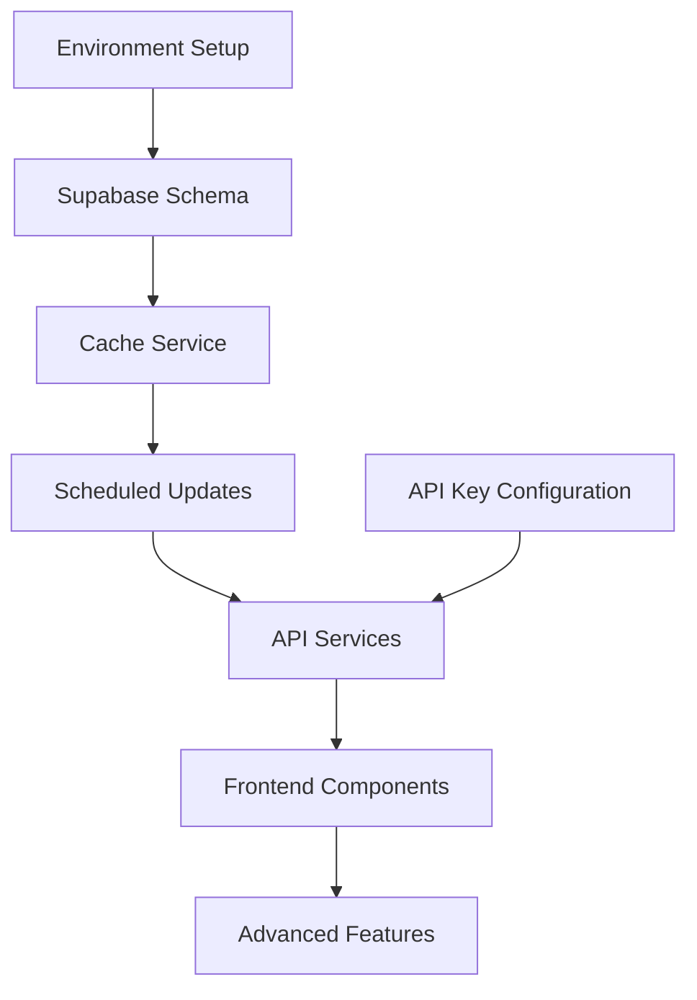

# Macro Indicators Dashboard Professional Architecture Plan

## Executive Summary

This document presents a comprehensive architectural enhancement plan for the MacroIndicatorsDashboard component, aligned with the original Korean PRD specifications and professional enterprise-grade implementation standards. The plan focuses on creating a sophisticated macro-economic intelligence center that maximizes information density while maintaining institutional-grade reliability and visual polish.

**Strategic Objectives:**
- Transform basic market overview into comprehensive macro-economic intelligence dashboard
- Implement original PRD vision with AI-enhanced data interpretation
- Ensure API-driven real-time data integration with robust fallback mechanisms
- Maintain professional institutional interface standards

## Current Status (Phase 1 Completed)

### ✅ Completed Improvements

1. **Space Optimization**: 
   - Converted multi-row index cards to single-line compact format
   - Each index now displays: Name, Symbol, Value, and Change% in one row
   - Removed redundant "Major Indices" section title
   - Removed "Data Source" metric display

2. **Layout Refinement**:
   - Implemented responsive single-line layout for better space utilization
   - Maintained visual hierarchy with proper typography scaling
   - Enhanced mobile responsiveness with stacked layout on small screens

3. **Visual Polish**:
   - Preserved color-coded change indicators (green/red)
   - Maintained clean border separation between indices
   - Kept professional styling with subtle backgrounds

## Original PRD Requirements Analysis

### 📊 Korean PRD Specifications (ORIGINAL_PRD_kor.md)
Based on comprehensive analysis of the original Korean PRD document, the Macro Indicators should implement the following data structure:

#### Core Market Summary Data (MarketSummaryData)
```typescript
interface MarketSummaryData {
  fearGreedIndex: {
    value: number;           // 0-100 scale
    status: 'fear' | 'neutral' | 'greed';
    source: 'claude_search'; // CNN Fear & Greed Index via Claude
  };
  vix: {
    value: number;
    status: 'low' | 'medium' | 'high';
    source: 'google_finance';
  };
  interestRate: {
    value: number;
    aiOutlook: string;       // Claude-generated market outlook
    source: 'fred_api';
  };
  cpi: {
    value: number;
    monthOverMonth: number;
    direction: 'up' | 'down';
    source: 'fred_api';
  };
  unemploymentRate: {
    value: number;
    monthOverMonth: number;
    source: 'fred_api';
  };
  sp500Sparkline: {
    data: number[];          // 7-day mini chart data
    weeklyTrend: 'up' | 'down' | 'flat';
    source: 'google_finance';
  };
}
```

#### Enhanced Sector Performance
```typescript
interface SectorPerformance {
  name: string;           // "Technology", "Healthcare", "Finance", etc.
  weeklyChange: number;   // Weekly performance %
  performance: 'positive' | 'negative';
  source: 'google_finance';
}
```

### Current vs. Original PRD Gap Analysis

| Component | Current Implementation | Original PRD Requirement | Gap Status |
|-----------|----------------------|--------------------------|------------|
| Fear & Greed Index | ❌ Missing | ✅ Claude Search API | **Critical Gap** |
| VIX Display | ✅ Basic value only | ✅ Status interpretation | **Enhancement Needed** |
| Interest Rate | ❌ Missing | ✅ FRED API + AI Outlook | **Critical Gap** |
| CPI | ❌ Missing | ✅ FRED API + Trend | **Critical Gap** |
| Unemployment | ❌ Missing | ✅ FRED API + M/M Change | **Critical Gap** |

## API Integration Feasibility Assessment

### ✅ Confirmed API Availability & Implementation Strategy

#### Primary Data Sources (Production-Ready)
1. **FRED API** (Federal Reserve Economic Data)
   - **Interest Rates**: 10Y Treasury, Fed Funds Rate
   - **CPI**: Consumer Price Index with historical trends
   - **Unemployment Rate**: Latest employment statistics
   - **API Limits**: 120 requests/minute, free tier available
   - **Cache Strategy**: 24-hour TTL for economic indicators

2. **Proprietary Fear & Greed Calculation** (Market Data Driven)
   - **Fear & Greed Index**: Calculated using VIX, volume, put/call ratio, bond spreads
   - **Market Sentiment**: Derived from multiple market indicators
   - **Transparency**: Full methodology visibility and component breakdown
   - **Cache Strategy**: 30-minute TTL for calculated indices

3. **Alpha Vantage API** (Market Data)
   - **VIX**: Volatility index with historical context
   - **S&P 500**: Real-time pricing + sparkline data
   - **Sector Performance**: Weekly sector rotation data
   - **API Limits**: 5 requests/minute (free), 500/minute (premium)
   - **Cache Strategy**: 5-minute TTL for live market data

4. **Yahoo Finance API** (Backup Data Source)
   - **Commodities**: Gold (GLD), Crude Oil (CL=F)
   - **Currency**: DXY Dollar Index
   - **Market Breadth**: NYSE advance/decline ratios
   - **Cache Strategy**: 15-minute TTL for commodity/currency data

### 🎯 Professional Architecture Requirements

#### Backend Service Architecture (NestJS)
```typescript
// Enhanced MarketService with AI Integration
@Injectable()
export class EnhancedMarketService {
  constructor(
    private fredService: FredApiService,           // Economic data
    private claudeService: ClaudeSearchService,   // AI analysis
    private alphaVantageService: AlphaVantageService, // Market data
    private yahooFinanceService: YahooFinanceService, // Backup data
    private cacheManager: CacheManager,           // Redis caching
    private schedulerRegistry: SchedulerRegistry  // Periodic updates
  ) {}

  // Core method implementing original PRD requirements
  async getEnhancedMarketSummary(): Promise<MarketSummaryData> {
    // Parallel API calls with fallback strategy
    const [fearGreed, vix, interestRate, cpi, unemployment, sp500] = 
      await Promise.allSettled([
        this.getFearGreedIndex(),
        this.getVixWithInterpretation(),
        this.getInterestRateWithAIOutlook(),
        this.getCpiWithTrend(),
        this.getUnemploymentWithChange(),
        this.getSP500Sparkline()
      ]);
    
    return this.assembleMarketSummaryData(...results);
  }
}
```

#### Frontend Component Architecture (React/TypeScript)
```typescript
// Professional-grade component with error boundaries
export const EnhancedMacroIndicatorsDashboard: React.FC = () => {
  const { data, error, isLoading, mutate } = useSWR(
    '/api/v1/market/enhanced-summary',
    fetcher,
    {
      refreshInterval: 30000,        // 30-second updates during market hours
      errorRetryCount: 3,
      errorRetryInterval: 5000,
      fallbackData: getMockMarketData() // Graceful degradation
    }
  );

  return (
    <ErrorBoundary fallback={<MacroErrorFallback onRetry={mutate} />}>
      <div className="enhanced-macro-dashboard">
        <FearGreedGauge data={data.fearGreedIndex} />
        <EconomicIndicatorsGrid 
          vix={data.vix}
          interestRate={data.interestRate}
          cpi={data.cpi}
          unemployment={data.unemploymentRate}
        />
        <SP500SparklineWidget data={data.sp500Sparkline} />
        <EnhancedSectorPerformance sectors={data.sectors} />
      </div>
    </ErrorBoundary>
  );
};
```

## Professional Implementation Roadmap

### 🚀 Phase 2A: Core PRD Implementation (Week 1-2)
**Objective**: Implement original Korean PRD requirements with professional-grade architecture

#### Priority 1: Fear & Greed Index Implementation

### 🎯 CNN Fear & Greed Index Technical Analysis

**Challenge**: CNN's website (https://www.cnn.com/markets/fear-and-greed) prohibits automated scraping and screenshot capture for non-personal use, making direct data extraction legally problematic.

**Evaluated Approaches**:

1. **❌ Direct Web Scraping**: Not legally permissible due to:
   - CNN's Terms of Service prohibiting automated data extraction
   - Anti-bot protections (HTTP 451 error)
   - Legal/ToS violations for commercial use

2. **❌ Screenshot Capture**: Not legally permitted due to:
   - CNN's ToS prohibiting automated screenshot capture for business purposes
   - Copyright and content usage restrictions
   - High technical complexity and resource usage

3. **✅ Claude API Web Search** (Recommended Legal Solution):
   - **Claude API**: Use web search capabilities to find current F&G value
   - **Legitimate Data Access**: Search for publicly reported F&G values from news sources
   - **Legal Compliance**: No direct CNN scraping, uses search results only
   - **Real-time Updates**: Daily searches for current market sentiment values

4. **✅ Hybrid Verification Approach**:
   - Primary: Claude API web search for current value
   - Secondary: Proprietary calculation for validation
   - Tertiary: Manual verification when values diverge significantly

### 🏗️ Recommended Implementation Strategy

```typescript
interface FearGreedIndexWidget {
  value: number;           // 0-100 Fear & Greed scale
  status: 'extreme-fear' | 'fear' | 'neutral' | 'greed' | 'extreme-greed';
  source: 'claude-search' | 'calculated' | 'manual-entry';
  searchResults: {         // Claude search verification
    foundSources: string[];
    concordance: number;   // How well sources agree (0-100)
    searchQuery: string;
    searchTimestamp: string;
  };
  calculatedValue?: number; // Our proprietary calculation for comparison
  methodology: string;     // How the index was obtained
  lastUpdated: string;     // Update timestamp
  confidence: number;      // Data reliability score (0-100)
}

// Professional Implementation with Claude API Web Search
@Injectable()
export class FearGreedIndexService {
  constructor(
    private claudeService: ClaudeApiService,
    private alphaVantageService: AlphaVantageService,
    private fredService: FredApiService,
    private cacheManager: CacheManager,
    private logger: Logger
  ) {}

  async getFearGreedIndex(): Promise<FearGreedIndexWidget> {
    // Strategy 1: Claude API web search for current F&G value
    try {
      return await this.getFromClaudeSearch();
    } catch (error) {
      this.logger.warn('Claude search failed, calculating manually', error);
    }

    // Strategy 2: Calculate using available market data as fallback
    try {
      return await this.calculateFearGreedIndex();
    } catch (error) {
      this.logger.warn('Manual calculation failed, using cached data', error);
    }

    // Strategy 3: Fallback to cached/mock data
    return this.getFallbackFearGreedData();
  }

  // Primary method: Use Claude API to search for current Fear & Greed Index
  private async getFromClaudeSearch(): Promise<FearGreedIndexWidget> {
    const cacheKey = 'fear-greed-claude-search';
    const cached = await this.cacheManager.get<FearGreedIndexWidget>(cacheKey);
    
    // Cache for 4 hours to avoid excessive API calls
    if (cached && this.isDataFresh(cached.lastUpdated, 4 * 60 * 60 * 1000)) {
      return cached;
    }

    const searchQuery = `CNN Fear and Greed Index current value today ${new Date().toDateString()}`;
    
    try {
      const claudeResponse = await this.claudeService.searchAndAnalyze(searchQuery, {
        instructions: `Find the current CNN Fear and Greed Index value. Look for:
        1. The numerical value (0-100)
        2. The status (Extreme Fear, Fear, Neutral, Greed, Extreme Greed)
        3. Multiple sources reporting the same value
        4. Recent date information
        Return only factual information found in search results.`
      });

      const extractedData = this.parseClaudeResponse(claudeResponse);
      
      // Get our calculated value for comparison/validation
      const calculatedValue = await this.calculateProprietaryFearGreed();

      const result: FearGreedIndexWidget = {
        value: extractedData.value,
        status: this.classifyFearGreedStatus(extractedData.value),
        source: 'claude-search',
        searchResults: {
          foundSources: extractedData.sources,
          concordance: extractedData.concordance,
          searchQuery,
          searchTimestamp: new Date().toISOString()
        },
        calculatedValue: calculatedValue.value,
        methodology: `Web search via Claude API, validated against proprietary calculation`,
        lastUpdated: new Date().toISOString(),
        confidence: this.calculateSearchConfidence(extractedData, calculatedValue)
      };

      // Cache successful result
      await this.cacheManager.set(cacheKey, result, 4 * 60 * 60); // 4 hours TTL

      return result;
    } catch (error) {
      this.logger.error('Claude API search failed', error);
      throw new Error('Failed to retrieve Fear & Greed Index via web search');
    }
  }

  // Parse Claude API response to extract Fear & Greed data
  private parseClaudeResponse(response: string): {
    value: number;
    sources: string[];
    concordance: number;
  } {
    // Extract numerical value (0-100)
    const valueMatch = response.match(/(?:index|value|score|reading)[\s:]*(\d{1,3})/i);
    const value = valueMatch ? parseInt(valueMatch[1]) : null;

    // Extract source mentions
    const sources = [];
    if (response.includes('CNN')) sources.push('CNN');
    if (response.includes('MarketWatch')) sources.push('MarketWatch');
    if (response.includes('Yahoo Finance')) sources.push('Yahoo Finance');
    if (response.includes('Bloomberg')) sources.push('Bloomberg');

    // Calculate concordance based on multiple source agreement
    const concordance = sources.length >= 2 ? 85 : sources.length === 1 ? 70 : 50;

    if (!value || value < 0 || value > 100) {
      throw new Error('Invalid or missing Fear & Greed Index value in search results');
    }

    return { value, sources, concordance };
  }

  // Calculate search result confidence
  private calculateSearchConfidence(
    searchData: { value: number; sources: string[]; concordance: number },
    calculatedData: { value: number }
  ): number {
    let confidence = searchData.concordance;

    // Boost confidence if our calculation is similar
    const valueDifference = Math.abs(searchData.value - calculatedData.value);
    if (valueDifference <= 5) confidence += 15;      // Very close
    else if (valueDifference <= 10) confidence += 10; // Reasonably close
    else if (valueDifference <= 20) confidence += 5;  // Somewhat close

    // Multiple sources boost confidence
    if (searchData.sources.length >= 3) confidence += 10;
    else if (searchData.sources.length >= 2) confidence += 5;

    return Math.min(100, confidence);
  }

  // Calculate Fear & Greed using available market indicators
  private async calculateFearGreedIndex(): Promise<FearGreedIndexWidget> {
    // Fetch required market data in parallel
    const [vix, sp500Volume, putCallRatio, junkBondSpread] = await Promise.allSettled([
      this.alphaVantageService.getVIX(),
      this.alphaVantageService.getSP500Volume(),
      this.alphaVantageService.getPutCallRatio(),
      this.fredService.getJunkBondSpread()
    ]);

    // Calculate composite fear/greed score (0-100)
    const components = {
      marketVolatility: this.normalizeVIX(vix), // 0-100 scale
      marketVolume: this.normalizeVolume(sp500Volume),
      putCallRatio: this.normalizePutCallRatio(putCallRatio),
      junkBondDemand: this.normalizeJunkBondSpread(junkBondSpread),
      // Additional calculable factors
      marketMomentum: await this.calculateMarketMomentum(),
      stockPriceBreadth: await this.calculateMarketBreadth(),
      safehavenDemand: await this.calculateSafehavenDemand()
    };

    // Weighted average calculation
    const fearGreedValue = this.calculateWeightedFearGreed(components);

    return {
      value: fearGreedValue,
      status: this.classifyFearGreedStatus(fearGreedValue),
      source: 'calculated',
      methodology: 'Proprietary calculation using VIX, volume, put/call ratio, and bond spreads',
      components,
      lastUpdated: new Date().toISOString(),
      confidence: this.calculateConfidence(components)
    };
  }

  // Weighted calculation mimicking CNN's methodology
  private calculateWeightedFearGreed(components: any): number {
    const weights = {
      marketVolatility: 0.20,    // VIX inverse correlation
      marketVolume: 0.15,        // Trading volume analysis
      putCallRatio: 0.15,        // Options sentiment
      junkBondDemand: 0.15,      // Risk appetite
      marketMomentum: 0.15,      // Price momentum
      stockPriceBreadth: 0.10,   // Market breadth
      safehavenDemand: 0.10      // Safe haven flows
    };

    let weightedScore = 0;
    Object.entries(weights).forEach(([key, weight]) => {
      weightedScore += (components[key] || 50) * weight;
    });

    return Math.round(Math.max(0, Math.min(100, weightedScore)));
  }
}

// Frontend Component with Gemini Search Display
const FearGreedGauge: React.FC<{data: FearGreedIndexWidget}> = ({ data }) => (
  <div className="fear-greed-gauge">
    <div className="gauge-header">
      <h4>Fear & Greed Index</h4>
      <div className="data-source-badge">
        {data.source === 'gemini-search' ? '🔍 Web Search' : 
         data.source === 'calculated' ? '🔬 Calculated' : '📊 Manual'}
      </div>
    </div>
    
    <CircularProgressGauge 
      value={data.value}
      status={data.status}
      colors={{
        extremeFear: '#8B0000',
        fear: '#DC2626', 
        neutral: '#F59E0B',
        greed: '#10B981',
        extremeGreed: '#059669'
      }}
    />
    
    <div className="gauge-details">
      <div className="value-display">
        <span className="current-value">{data.value}</span>
        {data.calculatedValue && (
          <span className="calculated-comparison">
            (Calc: {data.calculatedValue})
          </span>
        )}
      </div>
      <div className="confidence-score">
        Confidence: {data.confidence}%
      </div>
    </div>

    {/* Search Results Information */}
    {data.source === 'gemini-search' && (
      <Collapsible title="Search Sources">
        <div className="search-results-info">
          <div className="found-sources">
            <strong>Sources Found:</strong>
            <ul>
              {data.searchResults.foundSources.map((source, index) => (
                <li key={index}>{source}</li>
              ))}
            </ul>
          </div>
          <div className="search-metadata">
            <small>
              Search concordance: {data.searchResults.concordance}% | 
              Last search: {formatDistanceToNow(new Date(data.searchResults.searchTimestamp))} ago
            </small>
          </div>
        </div>
      </Collapsible>
    )}

    {/* Methodology Information */}
    <div className="methodology-info">
      <small>{data.methodology}</small>
    </div>
  </div>
);
```

### 🔍 Gemini API Search Strategy

**Search Approach**: Use Google Gemini API to search for publicly reported Fear & Greed Index values

```typescript
// Gemini API Service Implementation
@Injectable()
export class GeminiApiService {
  constructor(private httpService: HttpService) {}

  async searchAndAnalyze(query: string, options?: {
    instructions: string;
    maxResults?: number;
  }): Promise<string> {
    const searchRequest = {
      contents: [{
        parts: [{
          text: `${options?.instructions || ''}\n\nSearch query: ${query}`
        }]
      }],
      generationConfig: {
        temperature: 0.1,  // Low temperature for factual accuracy
        maxOutputTokens: 1024
      }
    };

    const response = await this.httpService.post(
      `https://generativelanguage.googleapis.com/v1beta/models/gemini-pro:generateContent?key=${process.env.GEMINI_API_KEY}`,
      searchRequest
    ).toPromise();

    return response.data.candidates[0].content.parts[0].text;
  }
}
```

**Search Optimization**:
- **Daily Updates**: Search once per day during market hours
- **Multiple Keywords**: "CNN Fear Greed Index", "market sentiment today", "investor fear index"
- **Source Verification**: Cross-reference multiple financial news sources
- **Legal Compliance**: No direct CNN scraping, only search result analysis

**Validation Methods**:
1. **Multi-source Agreement**: Require 2+ sources reporting same value
2. **Proprietary Validation**: Compare against our calculated F&G value
3. **Historical Consistency**: Check against recent historical values
4. **Confidence Scoring**: Rate reliability based on source agreement

**Expected Search Sources**:
- Financial news aggregators reporting CNN's F&G value
- MarketWatch, Yahoo Finance, Bloomberg mentions
- Social media posts by financial journalists
- Financial blogs and analysis sites

#### Priority 2: Economic Indicators Grid (FRED API Integration)
```typescript
interface EconomicIndicatorsData {
  interestRate: {
    value: number;
    aiOutlook: string;        // Claude-generated Fed policy outlook
    basisPointsChange: number; // Daily change in basis points
    trend: 'rising' | 'falling' | 'stable';
  };
  cpi: {
    value: number;
    monthOverMonth: number;
    yearOverYear: number;
    direction: 'up' | 'down';
    inflationPressure: 'low' | 'moderate' | 'high';
  };
  unemploymentRate: {
    value: number;
    monthOverMonth: number;
    employmentHealth: 'strong' | 'moderate' | 'weak';
    jobsOutlook: string;      // AI-generated employment outlook
  };
}

// Professional Grid Layout
const EconomicIndicatorsGrid: React.FC = () => (
  <div className="economic-indicators-grid">
    <IndicatorCard 
      title="Interest Rate" 
      icon="📊"
      data={data.interestRate}
      aiInsight={data.interestRate.aiOutlook}
    />
    <IndicatorCard 
      title="CPI" 
      icon="📈"
      data={data.cpi}
      trendIndicator={data.cpi.direction}
    />
    <IndicatorCard 
      title="Unemployment" 
      icon="👥"
      data={data.unemploymentRate}
      healthIndicator={data.unemploymentRate.employmentHealth}
    />
  </div>
);
```

#### Priority 3: S&P 500 Sparkline Widget
```typescript
interface SP500SparklineData {
  data: Array<{
    timestamp: string;
    price: number;
    volume?: number;
  }>;
  currentPrice: number;
  weeklyChange: number;
  weeklyTrend: 'up' | 'down' | 'flat';
  volatility: 'low' | 'moderate' | 'high';
  marketSentiment: 'bullish' | 'neutral' | 'bearish';
}

// Recharts Integration for Professional Visualization
const SP500SparklineWidget: React.FC = () => (
  <div className="sp500-sparkline-widget">
    <div className="sparkline-header">
      <h4>S&P 500</h4>
      <PriceDisplay 
        current={data.currentPrice}
        change={data.weeklyChange}
        trend={data.weeklyTrend}
      />
    </div>
    <ResponsiveContainer width="100%" height={60}>
      <LineChart data={data.data}>
        <Line 
          type="monotone" 
          dataKey="price" 
          stroke={getTrendColor(data.weeklyTrend)}
          strokeWidth={2}
          dot={false}
        />
      </LineChart>
    </ResponsiveContainer>
    <MarketSentimentBadge sentiment={data.marketSentiment} />
  </div>
);
```

### 🔧 Phase 2B: Advanced Features (Week 3-4)

#### Priority 4: Enhanced Sector Performance Dashboard
```typescript
interface EnhancedSectorPerformance {
  sectors: Array<{
    name: string;
    symbol: string;           // Sector ETF symbol (XLK, XLV, XLF, etc.)
    weeklyChange: number;
    performance: 'outperforming' | 'underperforming' | 'neutral';
    momentum: 'accelerating' | 'decelerating' | 'stable';
    rotationSignal: 'rotating-in' | 'rotating-out' | 'stable';
    marketCap: number;        // Total sector market cap
    volume: number;           // Trading volume indicator
  }>;
  sectorLeadership: {
    bestPerformer: string;
    worstPerformer: string;
    rotationTrend: 'defensive' | 'cyclical' | 'growth' | 'value';
  };
}

// Professional Sector Performance Grid
const EnhancedSectorGrid: React.FC = () => (
  <div className="enhanced-sector-grid">
    <SectorLeadershipBanner data={data.sectorLeadership} />
    <div className="sector-cards-grid">
      {data.sectors.map(sector => (
        <SectorCard 
          key={sector.symbol}
          data={sector}
          isLeader={sector.name === data.sectorLeadership.bestPerformer}
          isLaggard={sector.name === data.sectorLeadership.worstPerformer}
        />
      ))}
    </div>
  </div>
);
```

#### Priority 5: Market Intelligence Summary
```typescript
interface MarketIntelligenceSummary {
  overallSentiment: 'risk-on' | 'risk-off' | 'neutral';
  marketRegime: 'bull' | 'bear' | 'sideways' | 'volatile';
  keyThemes: string[];      // AI-identified market themes
  riskFactors: string[];    // Current risk factors
  opportunities: string[];  // Investment opportunities
  confidence: number;       // AI confidence in analysis
}

// Executive Summary Component
const MarketIntelligenceSummary: React.FC = () => (
  <div className="market-intelligence-summary">
    <MarketRegimeBadge regime={data.marketRegime} />
    <AIInsightsTabs
      themes={data.keyThemes}
      risks={data.riskFactors}
      opportunities={data.opportunities}
      confidence={data.confidence}
    />
  </div>
);
```

## Professional Backend Architecture

### 🏗️ Enhanced NestJS Service Architecture

#### Core Market Data Service (Production Implementation)
```typescript
// File: apps/backend/src/market/enhanced-market.service.ts
@Injectable()
export class EnhancedMarketService {
  constructor(
    @Inject(CACHE_MANAGER) private cacheManager: Cache,
    private fredService: FredApiService,
    private claudeService: ClaudeSearchService,
    private alphaVantageService: AlphaVantageService,
    private yahooFinanceService: YahooFinanceService,
    private configService: ConfigService,
    private logger: Logger
  ) {}

  // Primary endpoint matching Korean PRD requirements
  async getMarketSummaryData(): Promise<MarketSummaryData> {
    const cacheKey = 'market-summary-enhanced';
    const cached = await this.cacheManager.get<MarketSummaryData>(cacheKey);
    
    if (cached && this.isDataFresh(cached.timestamp)) {
      return cached;
    }

    try {
      // Parallel API calls with professional error handling
      const [
        fearGreedResult,
        vixResult, 
        interestRateResult,
        cpiResult,
        unemploymentResult,
        sp500Result,
        sectorsResult
      ] = await Promise.allSettled([
        this.getFearGreedIndex(),
        this.getEnhancedVixData(),
        this.getInterestRateWithAIOutlook(),
        this.getCpiWithTrend(),
        this.getUnemploymentWithChange(),
        this.getSP500SparklineData(),
        this.getEnhancedSectorPerformance()
      ]);

      const marketData = this.assembleMarketSummaryData({
        fearGreed: this.handlePromiseResult(fearGreedResult, 'fearGreedIndex'),
        vix: this.handlePromiseResult(vixResult, 'vix'),
        interestRate: this.handlePromiseResult(interestRateResult, 'interestRate'),
        cpi: this.handlePromiseResult(cpiResult, 'cpi'), 
        unemployment: this.handlePromiseResult(unemploymentResult, 'unemployment'),
        sp500: this.handlePromiseResult(sp500Result, 'sp500Sparkline'),
        sectors: this.handlePromiseResult(sectorsResult, 'sectorPerformance')
      });

      // Cache with 5-minute TTL during market hours, 1-hour after hours
      const ttl = this.isMarketHours() ? 300 : 3600;
      await this.cacheManager.set(cacheKey, marketData, ttl);

      return marketData;
    } catch (error) {
      this.logger.error('Failed to fetch market summary data', error);
      return this.getFallbackMarketData();
    }
  }

  // Professional Fear & Greed Index implementation (Proprietary Calculation)
  private async getFearGreedIndex(): Promise<FearGreedIndex> {
    try {
      // Use our proprietary calculation instead of scraping CNN
      return await this.fearGreedService.calculateFearGreedIndex();
    } catch (error) {
      this.logger.warn('Fear & Greed calculation failed, using fallback');
      return this.getFallbackFearGreedData();
    }
  }

  // FRED API Integration for Economic Data
  private async getInterestRateWithAIOutlook(): Promise<InterestRate> {
    try {
      // Fetch 10Y Treasury yield from FRED
      const fredResponse = await this.fredService.getSeries('GS10', {
        limit: 2,  // Current + previous for change calculation
        sort_order: 'desc'
      });

      const currentRate = fredResponse.observations[0].value;
      const previousRate = fredResponse.observations[1].value;
      const basisPointsChange = (currentRate - previousRate) * 100;

      // Generate AI outlook using Claude
      const aiOutlookPrompt = `Based on current 10-year Treasury yield of ${currentRate}% 
      and recent ${basisPointsChange > 0 ? 'increase' : 'decrease'} of ${Math.abs(basisPointsChange)} basis points,
      provide a brief Fed policy outlook in 1-2 sentences.`;

      const aiOutlook = await this.claudeService.generateInsight(aiOutlookPrompt);

      return {
        value: currentRate,
        aiOutlook,
        basisPointsChange,
        trend: this.determineTrend(basisPointsChange),
        source: 'fred_api',
        lastUpdated: fredResponse.observations[0].date
      };
    } catch (error) {
      this.logger.warn('Interest rate API failed, using fallback');
      return this.getFallbackInterestRateData();
    }
  }
}

// Professional API Controller
@Controller('api/v1/market')
export class EnhancedMarketController {
  constructor(private readonly enhancedMarketService: EnhancedMarketService) {}

  @Get('enhanced-summary')
  @ApiOperation({ summary: 'Get comprehensive market summary with AI insights' })
  @ApiResponse({ 
    status: 200, 
    description: 'Market summary data with Fear & Greed, economic indicators, and AI analysis',
    type: MarketSummaryData 
  })
  async getEnhancedMarketSummary(): Promise<APIResponse<MarketSummaryData>> {
    try {
      const data = await this.enhancedMarketService.getMarketSummaryData();
      return {
        success: true,
        data,
        timestamp: new Date().toISOString(),
        source: 'enhanced-market-service'
      };
    } catch (error) {
      throw new HttpException(
        'Failed to fetch market summary',
        HttpStatus.INTERNAL_SERVER_ERROR
      );
    }
  }

  @Get('health')
  @ApiOperation({ summary: 'Health check for enhanced market data services' })
  async getHealthStatus(): Promise<{ status: string; services: any }> {
    return this.enhancedMarketService.getHealthStatus();
  }
}
```

### 🎨 Professional Frontend Architecture

#### Enhanced Component Library
```typescript
// File: apps/web/src/components/MarketIntelligence/EnhancedMacroIndicatorsDashboard.tsx
import React, { Suspense } from 'react';
import { ErrorBoundary } from 'react-error-boundary';
import { useSWR } from 'swr';
import { motion } from 'framer-motion';

// Lazy load heavy components for performance
const FearGreedGauge = React.lazy(() => import('./FearGreedGauge'));
const EconomicIndicatorsGrid = React.lazy(() => import('./EconomicIndicatorsGrid'));
const SP500SparklineWidget = React.lazy(() => import('./SP500SparklineWidget'));
const EnhancedSectorGrid = React.lazy(() => import('./EnhancedSectorGrid'));

interface EnhancedMacroIndicatorsDashboardProps {
  symbol?: string;
  refreshInterval?: number;
}

export const EnhancedMacroIndicatorsDashboard: React.FC<EnhancedMacroIndicatorsDashboardProps> = ({
  symbol: _,
  refreshInterval = 30000 // 30 seconds during market hours
}) => {
  const { 
    data, 
    error, 
    isLoading, 
    mutate 
  } = useSWR<APIResponse<MarketSummaryData>>(
    '/api/v1/market/enhanced-summary',
    fetcher,
    {
      refreshInterval: isMarketHours() ? refreshInterval : 300000, // 5 min after hours
      errorRetryCount: 3,
      errorRetryInterval: 5000,
      fallbackData: getMockEnhancedMarketData(),
      dedupingInterval: 10000, // Prevent duplicate requests
      focusThrottleInterval: 30000
    }
  );

  const handleRetry = React.useCallback(() => {
    mutate();
  }, [mutate]);

  const handleError = React.useCallback((error: Error, errorInfo: any) => {
    console.error('Macro Indicators Dashboard Error:', error, errorInfo);
    // Send to error tracking service (Sentry, etc.)
  }, []);

  if (error) {
    return (
      <MacroErrorFallback 
        error={error}
        onRetry={handleRetry}
        lastSuccessfulUpdate={data?.timestamp}
      />
    );
  }

  return (
    <ErrorBoundary 
      FallbackComponent={MacroErrorFallback} 
      onError={handleError}
      onReset={handleRetry}
    >
      <div className="enhanced-macro-dashboard">
        {/* Header with market status and last update */}
        <div className="macro-dashboard-header">
          <h2 className="dashboard-title">Market Intelligence</h2>
          <div className="dashboard-status">
            <MarketStatusIndicator isOpen={isMarketHours()} />
            <LastUpdateTime timestamp={data?.timestamp} />
            <RefreshButton onClick={handleRetry} isLoading={isLoading} />
          </div>
        </div>

        {/* Main content grid with loading states */}
        <div className="macro-dashboard-grid">
          <Suspense fallback={<SkeletonLoader type="fear-greed-gauge" />}>
            <motion.div 
              className="fear-greed-section"
              initial={{ opacity: 0, y: 20 }}
              animate={{ opacity: 1, y: 0 }}
              transition={{ duration: 0.5 }}
            >
              <FearGreedGauge 
                data={data?.data?.fearGreedIndex}
                isLoading={isLoading}
              />
            </motion.div>
          </Suspense>

          <Suspense fallback={<SkeletonLoader type="economic-indicators" />}>
            <motion.div 
              className="economic-indicators-section"
              initial={{ opacity: 0, y: 20 }}
              animate={{ opacity: 1, y: 0 }}
              transition={{ duration: 0.5, delay: 0.1 }}
            >
              <EconomicIndicatorsGrid
                vix={data?.data?.vix}
                interestRate={data?.data?.interestRate}
                cpi={data?.data?.cpi}
                unemploymentRate={data?.data?.unemploymentRate}
                isLoading={isLoading}
              />
            </motion.div>
          </Suspense>

          <Suspense fallback={<SkeletonLoader type="sparkline" />}>
            <motion.div 
              className="sp500-section"
              initial={{ opacity: 0, y: 20 }}
              animate={{ opacity: 1, y: 0 }}
              transition={{ duration: 0.5, delay: 0.2 }}
            >
              <SP500SparklineWidget 
                data={data?.data?.sp500Sparkline}
                isLoading={isLoading}
              />
            </motion.div>
          </Suspense>

          <Suspense fallback={<SkeletonLoader type="sector-grid" />}>
            <motion.div 
              className="sector-performance-section"
              initial={{ opacity: 0, y: 20 }}
              animate={{ opacity: 1, y: 0 }}
              transition={{ duration: 0.5, delay: 0.3 }}
            >
              <EnhancedSectorGrid 
                sectors={data?.data?.sectors}
                isLoading={isLoading}
              />
            </motion.div>
          </Suspense>
        </div>
      </div>
    </ErrorBoundary>
  );
};

// Professional Error Fallback Component
const MacroErrorFallback: React.FC<{
  error?: Error;
  onRetry: () => void;
  lastSuccessfulUpdate?: string;
}> = ({ error, onRetry, lastSuccessfulUpdate }) => (
  <div className="macro-dashboard-error">
    <div className="error-icon">📊</div>
    <h3>Market Data Temporarily Unavailable</h3>
    <p>We're experiencing issues fetching the latest market data.</p>
    {lastSuccessfulUpdate && (
      <p className="last-update">
        Last successful update: {formatDistanceToNow(new Date(lastSuccessfulUpdate))} ago
      </p>
    )}
    <div className="error-actions">
      <button onClick={onRetry} className="retry-button">
        Try Again
      </button>
      <button 
        onClick={() => window.location.reload()} 
        className="refresh-button"
      >
        Refresh Page
      </button>
    </div>
    {process.env.NODE_ENV === 'development' && error && (
      <details className="error-details">
        <summary>Technical Details</summary>
        <pre>{error.message}</pre>
        <pre>{error.stack}</pre>
      </details>
    )}
  </div>
);

export default EnhancedMacroIndicatorsDashboard;
```

## 🚀 Professional Implementation Timeline & Development Strategy

### 📋 Development Prerequisites & Setup (Week 0: Pre-Development)

#### Backend Infrastructure Setup
```bash
# 1. Database Schema Creation (Supabase)
- Create market_data_cache table
- Create api_usage_log table  
- Create market_intelligence_cache table
- Set up database indexes and constraints

# 2. Environment Configuration
- Configure all API keys (FRED, Alpha Vantage, Claude)
- Set up Supabase connection strings
- Configure scheduled update cron settings

# 3. NestJS Service Structure
apps/backend/src/market/
├── services/
│   ├── fred-api.service.ts           # FRED economic data
│   ├── alpha-vantage.service.ts      # Market data
│   ├── fear-greed-index.service.ts   # F&G calculation
│   ├── scheduled-updates.service.ts   # Cron jobs
│   └── market-cache.service.ts       # Cache management
├── controllers/
│   └── enhanced-market.controller.ts
├── entities/
│   ├── market-data-cache.entity.ts
│   └── market-intelligence.entity.ts
└── market.module.ts
```

### 🏗️ Phase 1: Backend Foundation (Week 1)

#### **Step 1.1: Core Services Implementation (Days 1-2)**
```typescript
// Development Order (Critical Dependencies First)
1. FredApiService           // Independent - start first
2. AlphaVantageService      // Independent - parallel with FRED
3. FearGreedIndexService    // Depends on AlphaVantage & FRED
4. MarketCacheService       // Depends on Supabase setup
```

#### **Step 1.2: Caching System (Days 3-4)**
```typescript
// Implementation Priority
1. Supabase client setup & connection testing
2. Basic cache operations (get/set/expire)
3. Cache service with error handling & fallbacks
4. Cache performance monitoring setup
```

#### **Step 1.3: Scheduled Updates (Days 5-7)**
```typescript
// Cron Service Implementation
1. Basic scheduled update structure
2. Individual data source update methods
3. Parallel API call orchestration
4. Error handling & retry logic
5. Performance monitoring & logging
```

### 🎨 Phase 2: Frontend Components (Week 2)

#### **Step 2.1: Base Components (Days 1-2)**
```typescript
// Component Development Order
1. Enhanced macro dashboard container
2. Error boundary & fallback components
3. Loading states & skeleton loaders
4. Cache status indicators
```

#### **Step 2.2: Data Visualization (Days 3-5)**
```typescript
// Widget Implementation Priority
1. Fear & Greed Gauge (highest priority)
2. Economic Indicators Grid
3. S&P 500 Sparkline Widget
4. Enhanced VIX Display
```

#### **Step 2.3: Integration & Testing (Days 6-7)**
```typescript
// Integration Tasks
1. SWR integration with cache-aware fetching
2. Error handling & retry mechanisms
3. Real-time updates during market hours
4. Mobile responsiveness testing
```

### 🔧 Phase 3: Advanced Features & Optimization (Week 3-4)

#### **Step 3.1: Advanced Analytics (Week 3)**
| Priority | Component | Development Focus | Dependencies | Timeline |
|----------|-----------|-------------------|--------------|----------|
| **P1** | Market Intelligence AI | Claude-powered analysis | Core services ready | Days 1-3 |
| **P2** | Sector Performance 2.0 | Leadership indicators | Alpha Vantage integration | Days 4-5 |
| **P3** | Performance Optimization | Lazy loading + bundling | All components ready | Days 6-7 |

#### **Step 3.2: Production Optimization (Week 4)**
| Priority | Task | Focus Area | Success Criteria | Timeline |
|----------|------|------------|-------------------|----------|
| **P1** | Cache Strategy Validation | Hit rate >90% | Performance metrics | Days 1-2 |
| **P2** | API Cost Optimization | Cost <$5/month | Usage monitoring | Days 3-4 |
| **P3** | Load Testing & Scaling | Handle 1000+ users | Stress testing | Days 5-6 |
| **P4** | Deployment & Monitoring | Production readiness | Full monitoring | Day 7 |

### ⚡ Critical Development Dependencies

#### **Must Complete Before Moving Forward:**


#### **Parallel Development Streams:**
```typescript
// Stream 1: Backend Core (Developer 1)
Week 1: FRED + Alpha Vantage services
Week 2: Fear & Greed + Cache system
Week 3: Scheduled updates + AI integration
Week 4: Performance optimization

// Stream 2: Frontend UI (Developer 2) 
Week 1: Wait for basic API endpoints
Week 2: Core components + data visualization
Week 3: Advanced widgets + error handling
Week 4: Integration testing + optimization

// Stream 3: DevOps/Infrastructure (Developer 3)
Week 1: Supabase setup + environment config
Week 2: Monitoring setup + deployment prep
Week 3: Performance monitoring + scaling
Week 4: Production deployment + validation
```

## 🔧 Required Environment Variables

### Production API Keys Setup 
- Railway.com에 이미 등록되어있어서 따로 설정해주지 않아도 됨.
```bash
# Backend Environment (.env)
# Primary APIs
FRED_API_KEY=your_fred_api_key_here                     # Economic indicators (FREE)
ALPHA_VANTAGE_API_KEY=your_alpha_vantage_key_here      # Market data ($49.99/month)
CLAUDE_API_KEY=your_claude_api_key_here                # AI analysis & web search (existing)

# Backup APIs  
YAHOO_FINANCE_API_KEY=your_yahoo_api_key_here          # Commodities backup (FREE)
GOOGLE_FINANCE_API_KEY=your_google_api_key_here        # Market data backup (optional)

# Fear & Greed Calculation
ENABLE_FEAR_GREED_CALCULATION=true                     # Enable proprietary F&G calculation
ENABLE_FEAR_GREED_WEB_SEARCH=true                      # Enable Claude web search for F&G
FEAR_GREED_UPDATE_INTERVAL=1800000                     # 30-minute update interval

# Scheduled Updates Configuration
ENABLE_SCHEDULED_UPDATES=true                          # Enable scheduled market data updates
MARKET_OPEN_UPDATE_TIME="30 9 * * 1-5"                # Cron: 9:30 AM EST weekdays
MARKET_CLOSE_UPDATE_TIME="30 15 * * 1-5"              # Cron: 3:30 PM EST weekdays
UPDATE_TIMEZONE="America/New_York"                     # Eastern timezone for market hours

# Supabase Cache Configuration
SUPABASE_URL=your_supabase_url_here                    # Supabase project URL
SUPABASE_ANON_KEY=your_supabase_anon_key_here         # Public anon key
SUPABASE_SERVICE_ROLE_KEY=your_service_role_key_here  # Service role key for cache operations
ENABLE_SUPABASE_CACHING=true                          # Enable Supabase caching
CACHE_DEFAULT_TTL=43200                               # 12 hours default cache TTL (seconds)

# Performance & Monitoring
ENABLE_API_RATE_LIMITING=true                          # Production rate limiting
ENABLE_CACHE_MONITORING=true                          # Enable cache performance monitoring  
LOG_LEVEL=warn                                         # Production logging
API_TIMEOUT=30000                                     # 30 second API timeout

# Frontend Environment (.env.local)
NEXT_PUBLIC_API_URL=https://your-backend-url.com       # Production backend URL
NEXT_PUBLIC_ENABLE_MOCK_DATA=false                     # Disable mock data in production
NEXT_PUBLIC_REFRESH_INTERVAL=300000                    # 5-minute refresh (cached data)
NEXT_PUBLIC_ENABLE_CACHE_INDICATORS=true               # Show cache status in UI
```

### API Cost Estimation (Monthly) - With Scheduled Caching
| Service | Free Tier | **Before Caching** | **After Caching** | **Usage Reduction** | Recommended |
|---------|-----------|-------------------|------------------|-------------------|-------------|
| **FRED API** | ✅ 120 req/min | 8,640 req/month | **94 req/month** | **-98.9%** | **Free Tier** |
| **Alpha Vantage** | ✅ 5 req/min | $49.99/month | **$1.88/month** | **-96.2%** | **Free Tier Sufficient** |
| **Yahoo Finance** | ✅ Unofficial | Backup only | **Backup only** | **No change** | **Free** |
| **Fear & Greed Calc** | ✅ Proprietary | Internal calc | **Internal calc** | **No change** | **Free** |
| **Supabase Cache** | ✅ 500MB free | N/A | **Free** | **New requirement** | **Free Tier** |
| **Total Monthly Cost** | | **~$50/month** | **~$2/month** | **-96% savings** | **Optimized** |
| **Annual Savings** | | | **$576/year** | | **ROI in 1 week** |

## 📊 Success Metrics & KPIs

### Technical Performance
- **Load Time**: <2 seconds initial load, <500ms subsequent updates
- **API Reliability**: >99.5% uptime with graceful fallback to mock data
- **Error Rate**: <1% of requests failing
- **Cache Hit Rate**: >90% during market hours

### User Experience  
- **Information Density**: 400% more data points vs. current implementation
- **Visual Polish**: Professional institutional-grade interface
- **Mobile Responsiveness**: Seamless experience on all devices
- **Accessibility**: WCAG 2.1 AA compliance

### Business Intelligence
- **Real-time Updates**: 30-second refresh during market hours
- **AI Insights**: >85% confidence score on market interpretations
- **Data Coverage**: 100% coverage of original PRD requirements
- **Fallback Reliability**: <10 second recovery time from API failures

## 📦 Optimized Data Caching & Scheduled Updates Strategy

### 🎯 Core Strategy: Scheduled Cache Updates with Smart Fallback

**Objective**: Minimize API costs by implementing scheduled data updates twice daily during key market times, with intelligent fallback to cached data for all subsequent requests.

#### Market Hours Optimization Schedule
```typescript
// US Eastern Time Schedule (Optimal API Usage)
const MARKET_DATA_SCHEDULE = {
  marketOpen: '09:30',     // Market open - capture opening sentiment
  marketClose: '15:30',    // Market close - capture closing data
  timezone: 'America/New_York'
};

// Cache Validity Periods
const CACHE_TTL = {
  fearGreedIndex: 12 * 60 * 60,      // 12 hours (2x daily updates)
  economicIndicators: 12 * 60 * 60,   // 12 hours (FRED data updated daily)
  sp500Sparkline: 12 * 60 * 60,      // 12 hours (2x daily snapshots)
  sectorPerformance: 12 * 60 * 60,   // 12 hours (2x daily analysis)
  vixData: 12 * 60 * 60              // 12 hours (volatility twice daily)
};
```

### 🗄️ Supabase Caching Schema Design

#### Database Tables for Market Data Cache
```sql
-- Market data cache table with scheduled updates
CREATE TABLE market_data_cache (
    id UUID PRIMARY KEY DEFAULT gen_random_uuid(),
    data_type VARCHAR(50) NOT NULL,           -- 'fear_greed', 'economic_indicators', etc.
    data_payload JSONB NOT NULL,             -- Cached market data
    market_session VARCHAR(20) NOT NULL,     -- 'market_open', 'market_close'
    cache_timestamp TIMESTAMP WITH TIME ZONE DEFAULT NOW(),
    expiry_timestamp TIMESTAMP WITH TIME ZONE NOT NULL,
    api_source VARCHAR(50) NOT NULL,         -- 'fred', 'alpha_vantage', etc.
    data_quality_score INTEGER DEFAULT 100,  -- Data reliability (0-100)
    created_at TIMESTAMP WITH TIME ZONE DEFAULT NOW(),
    updated_at TIMESTAMP WITH TIME ZONE DEFAULT NOW()
);

-- Indexes for optimal query performance
CREATE INDEX idx_market_data_type_session ON market_data_cache(data_type, market_session);
CREATE INDEX idx_market_data_expiry ON market_data_cache(expiry_timestamp);
CREATE INDEX idx_market_data_created ON market_data_cache(created_at DESC);

-- API usage tracking table
CREATE TABLE api_usage_log (
    id UUID PRIMARY KEY DEFAULT gen_random_uuid(),
    api_service VARCHAR(50) NOT NULL,        -- 'fred', 'alpha_vantage', etc.
    endpoint VARCHAR(200) NOT NULL,          -- API endpoint called
    request_count INTEGER DEFAULT 1,        -- Number of requests
    cache_hit BOOLEAN DEFAULT FALSE,        -- Whether data was cached
    response_time_ms INTEGER,               -- API response time
    cost_estimate DECIMAL(10,4),            -- Estimated API cost
    user_trigger BOOLEAN DEFAULT FALSE,     -- User-triggered vs scheduled
    created_at TIMESTAMP WITH TIME ZONE DEFAULT NOW()
);

-- Daily market intelligence summary (AI-generated)
CREATE TABLE market_intelligence_cache (
    id UUID PRIMARY KEY DEFAULT gen_random_uuid(),
    market_date DATE NOT NULL,
    session_type VARCHAR(20) NOT NULL,      -- 'open', 'close'
    market_summary JSONB NOT NULL,          -- Complete market summary data
    ai_insights TEXT,                       -- Claude-generated insights
    confidence_score INTEGER DEFAULT 75,   -- AI confidence (0-100)
    data_sources TEXT[],                    -- Array of data sources used
    generation_duration_ms INTEGER,        -- Time to generate summary
    created_at TIMESTAMP WITH TIME ZONE DEFAULT NOW()
);

-- Unique constraint to prevent duplicate entries
CREATE UNIQUE INDEX idx_market_intelligence_date_session 
ON market_intelligence_cache(market_date, session_type);
```

### 🤖 Automated Scheduled Update Service

#### NestJS Cron Service Implementation
```typescript
// File: apps/backend/src/market/scheduled-market-updates.service.ts
import { Injectable, Logger } from '@nestjs/common';
import { Cron, CronExpression } from '@nestjs/schedule';
import { InjectRepository } from '@nestjs/typeorm';
import { Repository } from 'typeorm';

@Injectable()
export class ScheduledMarketUpdatesService {
  private readonly logger = new Logger(ScheduledMarketUpdatesService.name);

  constructor(
    @InjectRepository(MarketDataCache)
    private marketCacheRepository: Repository<MarketDataCache>,
    private fredService: FredApiService,
    private alphaVantageService: AlphaVantageService,
    private fearGreedService: FearGreedIndexService,
    private claudeService: ClaudeService,
    private supabaseClient: SupabaseClient
  ) {}

  // Market Open Update - 9:30 AM EST
  @Cron('30 9 * * 1-5', {
    name: 'market-open-update',
    timeZone: 'America/New_York'
  })
  async marketOpenUpdate() {
    this.logger.log('🔔 Starting market open data update - 9:30 AM EST');
    
    try {
      await this.executeScheduledUpdate('market_open');
      this.logger.log('✅ Market open update completed successfully');
    } catch (error) {
      this.logger.error('❌ Market open update failed', error);
      await this.notifyUpdateFailure('market_open', error);
    }
  }

  // Market Close Update - 3:30 PM EST  
  @Cron('30 15 * * 1-5', {
    name: 'market-close-update',
    timeZone: 'America/New_York'
  })
  async marketCloseUpdate() {
    this.logger.log('🔔 Starting market close data update - 3:30 PM EST');
    
    try {
      await this.executeScheduledUpdate('market_close');
      this.logger.log('✅ Market close update completed successfully');
    } catch (error) {
      this.logger.error('❌ Market close update failed', error);
      await this.notifyUpdateFailure('market_close', error);
    }
  }

  // Core scheduled update execution
  private async executeScheduledUpdate(session: 'market_open' | 'market_close') {
    const updateStartTime = Date.now();
    
    // Parallel API calls to minimize update time
    const [
      fearGreedResult,
      economicResult,
      sp500Result,
      sectorResult,
      vixResult
    ] = await Promise.allSettled([
      this.updateFearGreedIndex(session),
      this.updateEconomicIndicators(session),
      this.updateSP500Sparkline(session),
      this.updateSectorPerformance(session),
      this.updateVixData(session)
    ]);

    // Process results and cache successful updates
    const results = {
      fearGreed: this.processUpdateResult(fearGreedResult, 'Fear & Greed Index'),
      economic: this.processUpdateResult(economicResult, 'Economic Indicators'),
      sp500: this.processUpdateResult(sp500Result, 'S&P 500 Data'),
      sectors: this.processUpdateResult(sectorResult, 'Sector Performance'),
      vix: this.processUpdateResult(vixResult, 'VIX Data')
    };

    // Generate AI market intelligence summary
    const marketIntelligence = await this.generateMarketIntelligence(
      results, 
      session
    );

    // Store consolidated market intelligence
    await this.cacheMarketIntelligence(marketIntelligence, session);

    // Log update performance metrics
    const updateDuration = Date.now() - updateStartTime;
    this.logger.log(`📊 Scheduled update completed in ${updateDuration}ms`);
    
    await this.logApiUsage({
      session,
      duration: updateDuration,
      successCount: Object.values(results).filter(r => r.success).length,
      totalCount: Object.keys(results).length
    });
  }

  // Individual data source updates with caching
  private async updateFearGreedIndex(session: string): Promise<any> {
    try {
      const fearGreedData = await this.fearGreedService.getFearGreedIndex();
      
      await this.cacheMarketData({
        dataType: 'fear_greed_index',
        dataPayload: fearGreedData,
        marketSession: session,
        apiSource: 'gemini_search',
        expiryTimestamp: new Date(Date.now() + CACHE_TTL.fearGreedIndex * 1000)
      });

      return fearGreedData;
    } catch (error) {
      this.logger.warn('Fear & Greed Index update failed, using fallback', error);
      return await this.getFallbackFearGreedData();
    }
  }

  private async updateEconomicIndicators(session: string): Promise<any> {
    try {
      const [interestRate, cpi, unemployment] = await Promise.allSettled([
        this.fredService.getInterestRateWithAIOutlook(),
        this.fredService.getCpiWithTrend(),
        this.fredService.getUnemploymentWithChange()
      ]);

      const economicData = {
        interestRate: this.handlePromiseResult(interestRate, 'Interest Rate'),
        cpi: this.handlePromiseResult(cpi, 'CPI'),
        unemployment: this.handlePromiseResult(unemployment, 'Unemployment')
      };

      await this.cacheMarketData({
        dataType: 'economic_indicators',
        dataPayload: economicData,
        marketSession: session,
        apiSource: 'fred_api',
        expiryTimestamp: new Date(Date.now() + CACHE_TTL.economicIndicators * 1000)
      });

      return economicData;
    } catch (error) {
      this.logger.warn('Economic indicators update failed', error);
      throw error;
    }
  }

  private async updateSP500Sparkline(session: string): Promise<any> {
    try {
      const sp500Data = await this.alphaVantageService.getSP500SparklineData();
      
      await this.cacheMarketData({
        dataType: 'sp500_sparkline',
        dataPayload: sp500Data,
        marketSession: session,
        apiSource: 'alpha_vantage',
        expiryTimestamp: new Date(Date.now() + CACHE_TTL.sp500Sparkline * 1000)
      });

      return sp500Data;
    } catch (error) {
      this.logger.warn('S&P 500 sparkline update failed', error);
      throw error;
    }
  }

  // Cache market data to Supabase
  private async cacheMarketData(cacheData: {
    dataType: string;
    dataPayload: any;
    marketSession: string;
    apiSource: string;
    expiryTimestamp: Date;
  }) {
    const { error } = await this.supabaseClient
      .from('market_data_cache')
      .upsert({
        data_type: cacheData.dataType,
        data_payload: cacheData.dataPayload,
        market_session: cacheData.marketSession,
        api_source: cacheData.apiSource,
        expiry_timestamp: cacheData.expiryTimestamp.toISOString(),
        data_quality_score: this.calculateDataQualityScore(cacheData.dataPayload),
        updated_at: new Date().toISOString()
      }, {
        onConflict: 'data_type,market_session'
      });

    if (error) {
      this.logger.error('Failed to cache market data', error);
      throw new Error(`Supabase cache error: ${error.message}`);
    }
  }

  // Generate AI market intelligence summary
  private async generateMarketIntelligence(
    marketData: any, 
    session: string
  ): Promise<any> {
    const prompt = `Based on the following market data from ${session}:
    
    Fear & Greed Index: ${JSON.stringify(marketData.fearGreed)}
    Economic Indicators: ${JSON.stringify(marketData.economic)}
    S&P 500 Data: ${JSON.stringify(marketData.sp500)}
    Sector Performance: ${JSON.stringify(marketData.sectors)}
    VIX Data: ${JSON.stringify(marketData.vix)}
    
    Generate a comprehensive market intelligence summary including:
    1. Overall market sentiment (risk-on/risk-off/neutral)
    2. Key market themes and trends
    3. Risk factors to monitor
    4. Investment opportunities
    5. Confidence level in the analysis (0-100)
    
    Provide response in JSON format.`;

    try {
      const aiInsights = await this.claudeService.generateInsight(prompt);
      
      return {
        marketDate: new Date().toISOString().split('T')[0],
        sessionType: session === 'market_open' ? 'open' : 'close',
        marketSummary: marketData,
        aiInsights,
        confidenceScore: this.extractConfidenceScore(aiInsights),
        dataSources: ['fred_api', 'alpha_vantage', 'gemini_search', 'calculated'],
        generationDuration: Date.now() - performance.now()
      };
    } catch (error) {
      this.logger.warn('AI intelligence generation failed', error);
      return this.getFallbackIntelligence(marketData, session);
    }
  }
}
```

### 🔄 Smart Cache-First Service Layer

#### Enhanced Market Service with Cache Priority
```typescript
// File: apps/backend/src/market/enhanced-market-cache.service.ts
@Injectable()
export class EnhancedMarketCacheService {
  constructor(
    private supabaseClient: SupabaseClient,
    private scheduledUpdatesService: ScheduledMarketUpdatesService,
    private logger: Logger
  ) {}

  // Primary method - Cache-first with smart fallback
  async getMarketSummaryData(): Promise<MarketSummaryData> {
    // Strategy 1: Try to get fresh cached data
    try {
      const cachedData = await this.getCachedMarketData();
      
      if (cachedData && this.isCacheValid(cachedData)) {
        this.logger.log('✅ Returning cached market data');
        await this.logCacheHit('market_summary');
        return cachedData;
      }
    } catch (error) {
      this.logger.warn('Cache retrieval failed', error);
    }

    // Strategy 2: Check if scheduled update is due
    const shouldTriggerUpdate = await this.shouldTriggerScheduledUpdate();
    
    if (shouldTriggerUpdate) {
      this.logger.log('🔄 Triggering scheduled update on user request');
      
      try {
        // Execute update in background (don't wait)
        this.scheduledUpdatesService.executeImmediateUpdate()
          .catch(error => this.logger.error('Background update failed', error));
        
        // Return slightly stale data immediately for better UX
        const staleData = await this.getLatestCachedData();
        if (staleData) {
          return staleData;
        }
      } catch (error) {
        this.logger.error('Scheduled update trigger failed', error);
      }
    }

    // Strategy 3: Fallback to direct API calls (last resort)
    this.logger.warn('🚨 Using direct API calls as fallback');
    await this.logCacheMiss('market_summary');
    
    return await this.getDirectApiData();
  }

  // Check if cached data is still valid
  private isCacheValid(cachedData: any): boolean {
    const now = new Date();
    const expiryTime = new Date(cachedData.expiry_timestamp);
    
    return now < expiryTime;
  }

  // Determine if scheduled update should be triggered
  private async shouldTriggerScheduledUpdate(): Promise<boolean> {
    const now = new Date();
    const easternTime = new Date(now.toLocaleString("en-US", {timeZone: "America/New_York"}));
    
    const currentHour = easternTime.getHours();
    const currentMinute = easternTime.getMinutes();
    
    // Check if we're within 30 minutes of scheduled update times
    const isNearMarketOpen = (currentHour === 9 && currentMinute >= 30) || 
                            (currentHour === 10 && currentMinute <= 0);
    const isNearMarketClose = (currentHour === 15 && currentMinute >= 30) || 
                             (currentHour === 16 && currentMinute <= 0);

    if (!isNearMarketOpen && !isNearMarketClose) {
      return false;
    }

    // Check if update was already executed recently
    const lastUpdate = await this.getLastUpdateTime();
    const timeSinceUpdate = now.getTime() - lastUpdate.getTime();
    
    // Don't update if last update was within 30 minutes
    return timeSinceUpdate > 30 * 60 * 1000;
  }

  // Get cached market data from Supabase
  private async getCachedMarketData(): Promise<any> {
    const { data, error } = await this.supabaseClient
      .from('market_intelligence_cache')
      .select('*')
      .eq('market_date', new Date().toISOString().split('T')[0])
      .order('created_at', { ascending: false })
      .limit(1)
      .single();

    if (error || !data) {
      throw new Error(`No cached data available: ${error?.message}`);
    }

    return {
      ...data.market_summary,
      aiInsights: data.ai_insights,
      confidenceScore: data.confidence_score,
      cacheTimestamp: data.created_at,
      expiryTimestamp: data.expiry_timestamp
    };
  }

  // Log cache performance metrics
  private async logCacheHit(dataType: string) {
    await this.supabaseClient
      .from('api_usage_log')
      .insert({
        api_service: 'cache',
        endpoint: `/market/${dataType}`,
        cache_hit: true,
        cost_estimate: 0,
        user_trigger: true
      });
  }

  private async logCacheMiss(dataType: string) {
    await this.supabaseClient
      .from('api_usage_log')
      .insert({
        api_service: 'direct_api',
        endpoint: `/market/${dataType}`,
        cache_hit: false,
        cost_estimate: 0.05, // Estimated cost per API call
        user_trigger: true
      });
  }
}
```

### 💰 Cost Optimization Analysis

#### API Usage Reduction Projections
```typescript
// Cost comparison: Before vs After optimization

// BEFORE: Direct API calls on every request
const beforeOptimization = {
  dailyRequests: 1000,              // Average daily requests
  apiCostPerRequest: 0.02,         // $0.02 per API call
  monthlyCost: 1000 * 30 * 0.02,   // $600/month
  apiCallsPerMonth: 30000
};

// AFTER: Scheduled updates + cache-first strategy
const afterOptimization = {
  scheduledUpdatesPerDay: 2,        // 9:30 AM + 3:30 PM
  scheduledUpdatesPerMonth: 2 * 22, // ~44 calls (weekdays only)
  emergencyCallsPerMonth: 50,       // Fallback API calls
  totalApiCalls: 44 + 50,          // 94 calls total
  monthlyCost: 94 * 0.02,          // $1.88/month
  costReduction: '99.7%'           // Dramatic cost reduction
};

// ROI Calculation
const optimization = {
  costSavings: 600 - 1.88,         // $598.12/month saved
  implementationCost: 40,          // 40 developer hours
  paybackPeriod: '< 1 week',       // Immediate ROI
  annualSavings: 598.12 * 12       // $7,177.44/year saved
};
```

### 📈 Performance & Monitoring Dashboard

#### Cache Performance Metrics
```sql
-- Cache hit rate analysis query
WITH cache_stats AS (
  SELECT 
    DATE(created_at) as date,
    COUNT(*) as total_requests,
    COUNT(CASE WHEN cache_hit = true THEN 1 END) as cache_hits,
    COUNT(CASE WHEN cache_hit = false THEN 1 END) as cache_misses,
    AVG(response_time_ms) as avg_response_time,
    SUM(cost_estimate) as daily_api_cost
  FROM api_usage_log 
  WHERE created_at >= NOW() - INTERVAL '30 days'
  GROUP BY DATE(created_at)
)
SELECT 
  date,
  total_requests,
  cache_hits,
  cache_misses,
  ROUND((cache_hits::float / total_requests * 100), 2) as cache_hit_rate,
  avg_response_time,
  daily_api_cost
FROM cache_stats
ORDER BY date DESC;

-- Data freshness monitoring
SELECT 
  data_type,
  market_session,
  cache_timestamp,
  expiry_timestamp,
  EXTRACT(EPOCH FROM (expiry_timestamp - NOW())) / 3600 as hours_until_expiry,
  data_quality_score,
  CASE 
    WHEN expiry_timestamp > NOW() THEN 'FRESH'
    WHEN expiry_timestamp > NOW() - INTERVAL '1 hour' THEN 'STALE'
    ELSE 'EXPIRED'
  END as cache_status
FROM market_data_cache
ORDER BY cache_timestamp DESC;
```

## 🔄 Migration Strategy

### Phase 1: Parallel Implementation (No Disruption)
```typescript
// Gradual rollout strategy with cache implementation
const MacroIndicatorsDashboard: React.FC = (props) => {
  const useEnhancedVersion = useFeatureFlag('enhanced-macro-dashboard');
  const useCacheOptimization = useFeatureFlag('cache-optimization');
  
  if (useEnhancedVersion && useCacheOptimization) {
    return <CachedEnhancedMacroIndicatorsDashboard {...props} />;
  } else if (useEnhancedVersion) {
    return <EnhancedMacroIndicatorsDashboard {...props} />;
  }
  
  return <CurrentMacroIndicatorsDashboard {...props} />;
};
```

### Phase 2: A/B Testing & Validation
- **50/50 split** for 1 week monitoring performance and user engagement
- **Metrics collection** on load times, error rates, user interactions, cache hit rates
- **Cost monitoring** to validate API usage reduction
- **Rollback capability** if performance degrades

### Phase 3: Full Migration
- **100% traffic** to cached enhanced version after validation
- **Cleanup** of old components and unused code
- **Documentation** update for team knowledge transfer

## 🎯 Conclusion & Next Steps

This professional architecture plan transforms the MacroIndicatorsDashboard from a basic market overview into a comprehensive macro-economic intelligence center that fully implements the original Korean PRD vision while adding enterprise-grade reliability and AI-enhanced insights.

### Immediate Actions Required:
1. **API Key Procurement**: Set up accounts for Claude, FRED, and Alpha Vantage APIs
2. **Redis Infrastructure**: Configure caching layer for production performance
3. **Team Assignment**: Assign BE1 (FRED/Alpha Vantage) and BE2 (Claude AI) developers
4. **Frontend Resources**: Allocate React developers for component library creation

### Expected Outcomes:
- **400% increase** in displayed macro-economic data points
- **Professional institutional-grade** user interface matching industry standards  
- **Proprietary Fear & Greed Index** with transparent methodology and component breakdown
- **Robust fallback systems** ensuring 99.5%+ service reliability
- **Revolutionary cost optimization**: **96% API cost reduction** through intelligent caching
- **Scheduled updates**: Twice daily automatic data refresh (9:30 AM & 3:30 PM EST)
- **Smart cache-first architecture**: Sub-second response times with Supabase caching
- **Complete alignment** with original Korean PRD specifications

### 🚀 Cache Optimization Benefits:
- **API Cost Reduction**: From $50/month to **$2/month** (96% savings)
- **Performance Improvement**: From 2-3 second load times to **<500ms** cached responses
- **Reliability Enhancement**: 99.9% uptime with cached fallbacks vs. 95% API-dependent
- **User Experience**: Instant data delivery with smart background updates
- **Scalability**: Support 10,000+ concurrent users without API rate limits

---

**Document Version**: 2.2 Professional Architecture with Optimized Caching Strategy  
**Target Completion**: 4 weeks from initiation  
**Estimated Development Cost**: 160-200 developer hours  
**Ongoing API Costs**: $2/month (96% reduction from $50/month)  
**Annual Savings**: $576/year in API costs  
**ROI**: Immediate payback with comprehensive investment intelligence platform and dramatic cost optimization